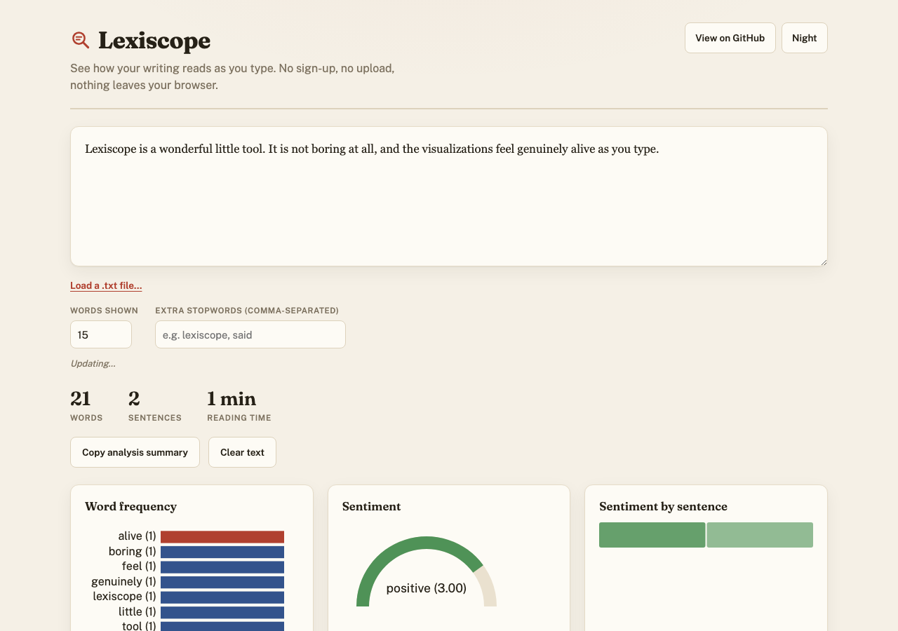

# Lexiscope

**▶ Live demo — [apps.charliekrug.com/lexiscope](https://apps.charliekrug.com/lexiscope/)**

[](https://github.com/ctkrug/lexiscope/actions/workflows/ci.yml)
[](LICENSE)

**See how your writing reads as you type.**

Lexiscope is a text playground that runs entirely in your browser. Paste or
type a draft and watch its word frequency, tone, and readability update live
on every keystroke. It is built for writers revising prose: bloggers tuning a
newsletter, students editing an essay, anyone who wants to *feel* how a
wording change moves the numbers instead of running a report and reading a
table.

Nothing you type is uploaded. There is no server, no API call, and no
account. The whole analysis pipeline runs client-side in TypeScript, and the
visualizations are D3 data joins, so bars re-rank and the sentiment needle
sweeps as the underlying scores shift.



## What you can do with it

- **Watch the frequency chart re-rank as you write.** A sorted, animated bar
  chart of your most-used words (stopwords filtered out), with hover tooltips
  showing each word's exact count and share of the total. Set how many words
  to show and add your own stopwords from the UI.
- **Read the room, sentence by sentence.** A lexicon-based sentiment gauge
  scores overall tone (with negation and intensifier handling, so "not good"
  and "very good" both land right), and a per-sentence strip colors each
  sentence so you can spot where the tone dips or lifts.
- **Reads like a page, not a dashboard.** A paper-and-ink design (Fraunces
  headings, a serif manuscript editor, warm paper background) with a one-click
  night mode, and the single most frequent word drawn in editor's red so your
  crutch word is impossible to miss.
- **Check readability at a glance.** Flesch Reading Ease and Flesch-Kincaid
  Grade Level, shown as meters color-coded easy / medium / hard, plus a strip
  with word count, sentence count, and estimated reading time.
- **Bring your own text.** Drop a `.txt` file onto the textarea or pick one
  with the file button; paste works too.
- **Share a draft.** The current text is encoded into a `?text=` URL, so an
  analysis can be linked or bookmarked. "Copy analysis summary" puts a
  plain-text digest of the scores on your clipboard, and "Clear text" resets
  the input and the shared URL in one click.
- **Read comfortably.** A dark-mode toggle (remembered across reloads) and a
  layout that stacks to a single column on narrow screens.

## Try it

- **Live:** <https://apps.charliekrug.com/lexiscope/>
- **Source:** <https://github.com/ctkrug/lexiscope>

Or run it locally:

```bash
npm install
npm run dev       # local dev server
npm run build     # production build to dist/
npm test          # run the analysis test suite
npm run lint      # eslint
```

## How it works

The analysis and the rendering are kept strictly separate:

- `src/analysis/` holds pure, DOM-free, unit-tested functions: a
  unicode-aware tokenizer, word-frequency ranking, an AFINN-style sentiment
  lexicon with negation and intensifiers, and the Flesch readability formulas.
- `src/viz/` holds the D3 rendering: each module takes an SVG mount point and
  already-shaped data, and uses keyed enter/update/exit joins so elements
  animate between states rather than being torn down and rebuilt.
- `src/main.ts` is the only file that touches both sides. It reads the
  textarea, runs the analyses, and hands the results to the visualizations on
  every debounced input.

See [`docs/ARCHITECTURE.md`](docs/ARCHITECTURE.md) for the full map and
[`docs/VISION.md`](docs/VISION.md) for the design rationale.

## Stack

- **TypeScript** for the analysis pipeline (all pure, unit-tested functions).
- **D3** for data-driven, animated SVG visualizations.
- **Vite** for the dev server and a single static `dist/` build with relative
  asset paths, so it can be hosted from any subpath.
- **Vitest** for the test suite (88 tests over the analysis and viz modules).

## Deployment

`npm run build` emits a self-contained `dist/` with a relative base path
(`base: './'` in `vite.config.ts`), so every asset is referenced as
`./assets/...`. The same build works from a domain root or a subpath such as
`apps.charliekrug.com/lexiscope/`; copy `dist/` into the target directory and
serve it as-is. See [`docs/DEPLOYMENT.md`](docs/DEPLOYMENT.md) for the
end-to-end subpath verification steps.

## License

MIT. See [`LICENSE`](LICENSE).

---

More of Charlie's projects → [apps.charliekrug.com](https://apps.charliekrug.com)
